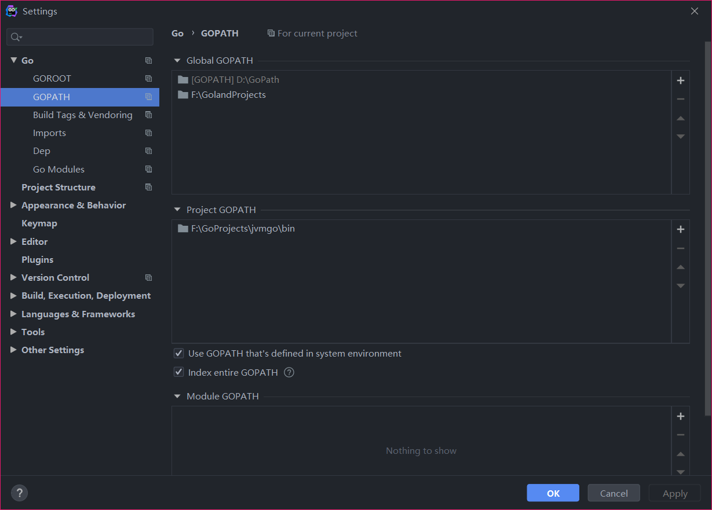
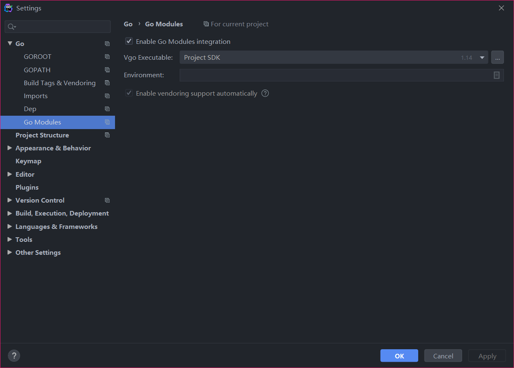

# jvmgo
go implement a simple java virtual machine






## 单目录编译
```bash
go build -o bin/ch01.exe jvmgo/ch01
```

## 编译脚本
```bash
cd ch01
build.sh
# 编译当前目录程序到bin目录下
```

## 功能列表
- ch01 命令行参数解析
```bash
ch01.exe -cp my/test Test name age
# classpath: my/test, class: Test args: [name age]

```
